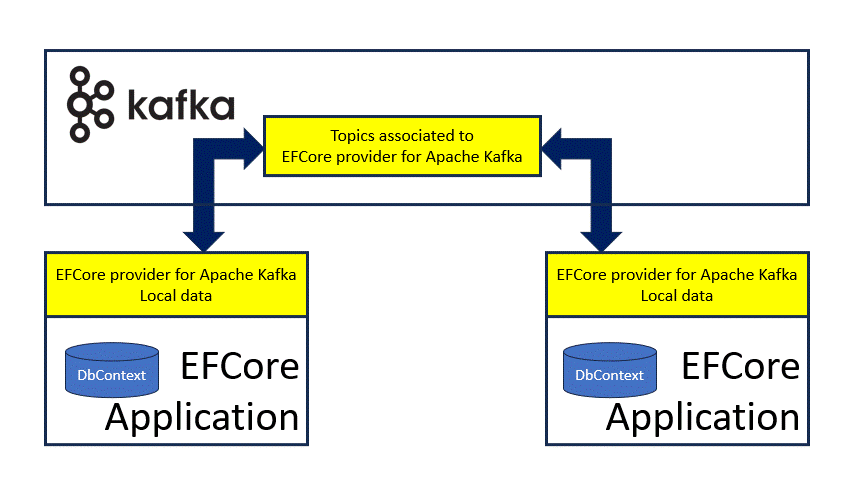

# KEFCore: use cases

[Entity Framework Core](https://learn.microsoft.com/it-it/ef/core/) provider for [Apache Kafka](https://kafka.apache.org/) can be used in some operative conditions.
Here a possible, non exhaustive list, of use cases.

Before read following chapters it is important to understand [how it works](howitworks.md).

## [Apache Kafka](https://kafka.apache.org/) as Database

The first use case can be coupled to a standard usage of [Entity Framework Core](https://learn.microsoft.com/it-it/ef/core/), the same when it is used with database providers.
In [getting started](gettingstarted.md) is proposed a simple example following the online documentation.
In the example the data within the model are stored in multiple Apache Kafka topics, each topic is correlated to the `DbSet` described from the `DbContext`.

The constraints are managed using `OnModelCreating` of `DbContext`.

## A different way to define data within [Apache Kafka](https://kafka.apache.org/) topics

Changing the mind about model, another use case can be coupled on how an [Entity Framework Core](https://learn.microsoft.com/it-it/ef/core/) model can be used.
Starting from the model proposed in [getting started](gettingstarted.md), the data within the model are stored in multiple Apache Kafka topics.
If the model is written in a way it describes the data to be stored within the topics it is possible to define an uncorrelated model containing the data of interest:

```cs
public class ModelContext : KafkaDbContext
{
    public DbSet<FirstData> FirstDatas { get; set; }
    public DbSet<SecondData> SecondDatas { get; set; }
}

public class FirstData
{
    public int ItemId { get; set; }
    public string Data { get; set; }
}

public class SecondData
{
    public int ItemId { get; set; }
    public string Data { get; set; }
}
```

Then using standard APIs of [Entity Framework Core](https://learn.microsoft.com/it-it/ef/core/), an user interacting with [Entity Framework Core](https://learn.microsoft.com/it-it/ef/core/) can stores, or retrieves, data without any, or limited, knowledge of Apache Kafka.

## [Apache Kafka](https://kafka.apache.org/) as distributed cache

Changing the mind a model is written for, it is possible to define a set of classes which acts as storage for data we want to use as a cache.
It is possible to build a new model like:
```cs
public class CachingContext : KafkaDbContext
{
    public DbSet<Item> Items { get; set; }
}

public class Item
{
    public int ItemId { get; set; }
    public string Data { get; set; }
}
```

Sharing it between multiple applications and allocating the `CachingContext` in each application, the cache is shared and the same data are available.

## [Apache Kafka](https://kafka.apache.org/) as a triggered distributed cache

Continuing from the previous use case, using the events reported from [Entity Framework Core](https://learn.microsoft.com/it-it/ef/core/) provider for [Apache Kafka](https://kafka.apache.org/) it is possible to write a reactive application.
When a change event is triggered the application can react to it and take an action.



### SignalR

The triggered distributed cache can be used side-by-side with [SignalR](https://learn.microsoft.com/it-it/aspnet/signalr/overview/getting-started/introduction-to-signalr): combining [Entity Framework Core](https://learn.microsoft.com/it-it/ef/core/) provider for [Apache Kafka](https://kafka.apache.org/) and [SignalR](https://learn.microsoft.com/it-it/aspnet/signalr/overview/getting-started/introduction-to-signalr) in an application, subscribing to the change events, it is possible to feed the connected applications to [SignalR](https://learn.microsoft.com/it-it/aspnet/signalr/overview/getting-started/introduction-to-signalr). 

### Redis

The triggered distributed cache can be seen as a [Redis](https://redis.io/) backend.

## Data processing out-side [Entity Framework Core](https://learn.microsoft.com/it-it/ef/core/) application

The schema used to write the information in the topics are available, or can be defined from the user, so an external application can use the data in many mode:
- Using the feature to extract the entities stored in the topics outside the application based on [Entity Framework Core](https://learn.microsoft.com/it-it/ef/core/)
- Use some features of Apache Kafka like Apache Kafka Streams or Apache Kafka Connect.

### External application

An application, not based on [Entity Framework Core](https://learn.microsoft.com/it-it/ef/core/), can subscribe to the topics to:
- store all change events to another medium
- analyze the data or the changes
- and so on

### Apache Kafka Streams

Apache Kafka comes with the powerful Streams feature. An application based on Streams can analyze streams of data to extract some information or converts the data into something else.
It is possible to build an application, based on Apache Kafka Streams, which hear on change events and produce something else or just sores them in another topic containing all events not only the latest (e.g. just like the transaction log of SQL Server does it). 

### Apache Kafka Connect

Apache Kafka comes with another powerful feature called Connect: it comes with some ready-made connector which connect Apache Kafka with other systems (database, storage, etc).
There are sink or source connectors, each connector has its own specificity:
- Database: the data in the topics can be converted and stored in a database
- File: the data in the topics can be converted and stored in one, or more, files
- Other: there are many ready-made connectors or a connector can be built using a [Connect SDK](https://github.com/masesgroup/KNet/blob/master/src/documentation/articles/connectSDK.md)

**NOTE**: While Apache Kafka Streams is an application running alone, Apache Kafka Connect can allocate the connectors using the distributed feature which load-balance the load and automatically restarts operation if something is going wrong.